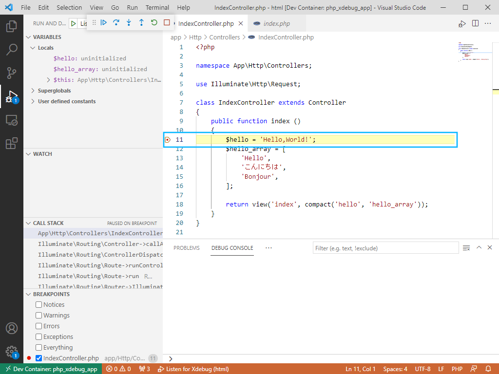

# Xdebugを入れたDocker上のPHP LaravelのWebアプリをVSCodeでステップ実行させるサンプル (WSL2)

<!-- TOC -->

[TOC]

# 背景

Laravelをはじめ、PHPのWebアプリケーション開発において、デバッグをする際、

```php
var_dump(○○○○○);
```

のように、変数をブラウザ上に出力する方法を取られることがあります。

しかし、この方法では、

- 条件分岐やループ等の処理の流れを追うことは難しい。
※追うためには多くの個所で`var_dump`等の出力を入れなければならない。
- 文字列以外のデータ（日付、リスト、辞書など）を読みやすい形式で出力されるとは限らない。
※表示用のフォーマットを設定したり、JSON形式にするなど、手間がかかる。
- デバッグ後に`var_dump`等のコードを確実に削除しなければならない。
※万一、削除漏れがあったままリリースすると、内部的な情報が表示されてしまう。

などの問題があり、効率的なデバッグをすることができませんよね。
開発している方の中にも、苦労されている方もいらっしゃると思います。

一方で、Xdebug等によるデバッグ環境構築の手順、特に、Dockerコンテナでの環境での手順は、あまりまとまっていないのようです。
社内の開発メンバーからも、手順を知っている人がいないか？という質問がありましたが、手順を把握しているメンバーはいませんでした。

そこで、実際にデバッグ環境を作ってみることにしました。

# はじめに

このサンプルは、DockerでPHPおよびNGINXのコンテナを作成し、PHPのコンテナにXdebugをインストールし、ローカルのVSCodeでステップ実行させるものです。

なお、今回は、Windows 10にWSL2（Windows Subsystem for Linux 2）でUbuntu 20.04をインストールし、その上にDockerおよびDocker Composeをインストールした環境を使用しています。

おそらく、Macでも使えると思いますが、Docker Desktop for Windowsについては、動作するかは不明です。申し訳ありませんがご了承ください。

# 前提

下記の環境が揃っている必要があります。

- Windows 10（HomeでもProでも）
- Windows Subsystem for Linux 2（以下、WSL2）
※Ubuntu 20.04を使用
- WSL2 Ubuntuに、下記をインストールします。
  - Docker、Docker Compose
  ※インストール方法は、私の記事ですみませんが、Qiitaに記載した[Ubuntu 20.04にDocker、Docker Composeをインストールする手順](https://qiita.com/murakami77/items/98ef607dc4ff0ae9a497) をご参照ください。
  - Visual Studio Code（以下、VSCode）をWindows 10にインストール
  ※VSCodeをインストールした状態で、WSL2で`code`を実行すると、WSL2にインストールされ、自動的にリモート接続されます。

# 使い方
## 前提の環境を揃える

[前提](#前提)の章に記載した環境が揃っていることを前提にします。

## VSCodeに拡張をインストール

WSL2 UbuntuでVSCodeを起動し、`Remote - Containers`の拡張をインストールします。


## ソースをclone

WSL2 Ubuntuで下記コマンドを実行し、GitHubからソースコードをダウンロードします。

```bash
git clone https://github.com/murakami0923/laravel-remote-debug-sample.git
cd laravel-remote-debug-sample/
```

## Docker定義をビルド

WSL2 Ubuntuで下記コマンドを実行し、Docker定義のディレクトリへ移動し、ビルドしてイメージを作成します。

```bash
cd docker/
./build-docker-compose.sh
```

成功したら、イメージを確認します。

```bash
docker images
```

を実行し、

```txt
docker_app:latest
docker_nginx:latest
```

のイメージが作成されていれば成功です。

## Docker Composeで起動

イメージが作成されたら、Docker Composeでコンテナを起動します。

**なお、シェルの変数にWSL2 Ubuntuのユーザー、グループの情報を入れてから実行する必要があるため、それらの処理を含めたBashのスクリプトを実行します。**

```bash
./start-docker-compose.sh
```

実行後、

```txt
Creating network "docker_laravel-docker-remote-debug-sample-network" with driver "bridge"
Creating laravel-remote-debug-sample-mariadb ... done
Creating laravel-remote-debug-sample-app     ... done
Creating laravel-remote-debug-sample-nginx   ... done
```

のように表示されれば成功です。

## Webブラウザでページ表示確認

Webブラウザで
[http://localhost/](http://localhost/)
へアクセスし、サンプルが表示されることを確認します。


## Remote - ContainersでPHP-FPMコンテナのVSCode Serverを開く


VSCodeの一番左下の緑色の部分をクリックします。


リモートで開く先を選ぶリストが表示されるので、`Reopen in Container`をクリックします。


コンテナ内で開くと、左下の部分が`Dev Container: php_xdebux_app`なります。

**【補足】**
**DockerやDocker Copmposeの定義を変更してビルド、Docker Composeを実行した後で、`Reopen in Container`を選択すると、確認ダイアログが表示されることがあります。**


**この場合、既にビルド、Docker Composeを実行済みのため、`Ignore`ボタンで無視して構いません。**

## デバッグを開始し、ステップ実行

※`php_xdebug_app`はリモートコンテナの設定ファイル`.devcontainer/devcontainer.json`に指定した名前です。

左側の`Run and Debug`のアイコンをクリックします。


デバッグ設定のリストから`Listen for Xdebug`を選択し、デバッグを実行します。


デバッグが開始されたことを確認し、左側の`Explorer`のアイコンをクリックします。


`app/Http/Controllers/IndexController.php`を開き、ブレークポイントを設定します。

次に、Webブラウザで
[http://localhost/](http://localhost/)
へアクセスします。


デバッグの設定ファイル`.vscode/launch.json`では、 最初に制御が来たソースの先頭で必ずブレークする設定をしているので、`index.php`の最初の処理でブレークポイントで処理が中断されます。



`F5`キーで実行が継続され、`IndexController.php`でブレークポイントを設定した箇所で処理が中断されます。


`F10`キーで処理を1行ずつステップ実行していくと、左側ペインの`VARIABLES`のツリーで、変数の内容を確認することができます。

その後、`F5`キーで処理を続行し、一通りの処理が完了すると、Webブラウザにページが表示されます。


## デバッグ終了

デバッグが終わったら、デバッグの`STOP`アイコンのボタンをクリックします。


デバッグが終了されたら、VSCodeの一番左下の緑色の部分をクリックします。


リモートで開く先を選ぶリストが表示されるので、`Reopen Folder in WSL`をクリックし、WSL2のVSCodeに戻ります。


# 【解説】全体の構成の概要
## 構成図

全体の構成を図にまとめます。


Docker Composeで下記3つのコンテナを起動します。

- NGINX
- PHP-FPM（Laravelアプリケーション）
- MariaDB

## PHPの処理の流れ

このとき、NGINXコンテナの`nginx-app.conf`ファイルで、`\*.php`へのアクセスの場合、FastCGIでPHP-FPM（Laravelアプリケーション）のコンテナの9000ポートへアクセスを渡すように設定します。

その後、開発者がWebブラウザでNGINXにアクセスすると、PHPへのアクセスの場合、PHP-FPMコンテナに処理が渡り、処理後にレスポンスを開発者のWebブラウザに返ります。

## PHP-FPMコンテナ上でのデバッグ

また、PHP-FPM内のLaravelアプリケーションには`Xdebug`をインストール・設定し、開発者のVSCodeに`Remote Containers`の拡張機能をインストール・設定します。

その後、開発者がWSL2でVSCodeを開き、続いて、`Remote Containers`に設定したコンテナを開くと、コンテナ上に`VSCode Server`がインストールされ、自動的に開きます。
次に、XCodeのデバッグ設定をしてデバッグを実行すると、コンテナ上のVSCode ServerがXdebugに接続し、デバッグ可能となります。

`VSCode Server`で、Controller等にブレークポイントを設定し、Webブラウザでサイトにアクセスすると、ブレークポイントで処理が止まり、ステップ実行しながら変数等の状態を確認することができます。

### Docker Composeのボリュームについて

Laravelアプリケーション（`laravel-app`ディレクトリ）をボリュームに設定します。

NGINX、PHP-FPMの書くコンテナにおいて、`/var/www/html`がRootディレクトリとなるため、`laravel-app`をボリュームとして設定します。

なお、WSL2 Ubuntuで使用しているユーザーのuidとアプリケーション実行ユーザーのuidが合わないと、ディレクトリやファイルへの読取り・書込み・実行の権限が、Laravelアプリケーションを正しく実行できないことがあります。

PHP-FPMのアプリケーション実行ユーザは、デフォルトでは`www-data`（uid : `33`）となっていますが、WSL2ユーザーのユーザーとグループをPHP-FPMコンテナ内に作成し、そのユーザーでアプリケーションを実行するようにしています。


## 【解説】Docker定義
### NGINXコンテナ定義

定義：`docker/laravel-remote-debug-sample-nginx`

LaravelのPHPアプリケーションへアクセスが来た時に、PHP-FPMコンテナに処理を渡すための設定が必要になるので、下記設定ファイルにて定義しています。

設定ファイル：`nginx-app.conf`

```conf
server {
    listen 80;
 
    root  /var/www/html/public;
    index index.php index.html index.htm;
 
    access_log /var/log/nginx/app-access.log;
    error_log  /var/log/nginx/app-error.log;

     # 全てのアクセスに対しての処理。左からドキュメントルート配下を参照する。以下の場合は3つのステップを踏んでいる
    # １）　アクセスがきたパスの静的ファイルが存在するか
    # 2)　アクセスがきたパスのディレクトリが存在するか（見つかったらその中の indexを参照する）
    # 3)　上の二つがない場合、index.phpのファイルとする（Laravelに処理を任せる）
    location / {
        try_files $uri $uri/ /index.php?$query_string;
    }
    
    # 静的ファイルの時の処理。正規表現によるパターンマッチングが使える
    location ~* \.(jpg|jpeg|gif|css|png|js|ico|svg)$ {
        expires 30d; # キャッシュの設定。クエリーを変更の処理がしっかりさmaxでもいい。今回は30日
        log_not_found off; # ログを出さない。publicサーバは攻撃に晒されていてログがたくさん出てしまうため
        access_log off; # 同じ理由でアクセスログも見えないようにしている
    }
 
    location ~ \.php$ {
        fastcgi_split_path_info ^(.+\.php)(/.+)$;
        fastcgi_pass   laravel-remote-debug-sample-app:9000;
        fastcgi_index  index.php;
 
        include        fastcgi_params;
        fastcgi_param  SCRIPT_FILENAME $document_root$fastcgi_script_name;
        fastcgi_param  PATH_INFO $fastcgi_path_info;
    }
}
```

このファイルをCOPYし、コンテナ内に設置するよう、`Dockerfile`に記載しています。

```dockerfile
COPY nginx-app.conf /etc/nginx/conf.d/
RUN mv /etc/nginx/conf.d/nginx-app.conf /etc/nginx/conf.d/app.conf
```

## PHP-FPMコンテナ定義

定義：`docker/laravel-remote-debug-sample-app`

Xdebugをインストールするよう、`Dockerfile`に記載しています。

```dockerfile
COPY --from=mlocati/php-extension-installer /usr/bin/install-php-extensions /usr/local/bin/
RUN install-php-extensions gd xdebug
```

また、Xdebugの設定ファイルを作成します。

設定ファイル：`docker-php-ext-xdebug.ini`

```ini
zend_extension=xdebug
xdebug.client_host = localhost
xdebug.start_with_request = yes
xdebug.mode = debug
; port 番号はデフォルトで9003番ですがわかりやすいように明示的に書いています。9003ではなくても空いているポートなら大丈夫です。
; 後述する .devcontainer/devcontainer.json　に書く port と同じにしてください。
xdebug.client_port = 9003
xdebug.log = /var/log/xdebug.log
```

この設定ファイルを設置するよう、`Dockerfile`に記載しています。

```dockerfile
RUN mv /usr/local/etc/php/conf.d/docker-php-ext-xdebug.ini /tmp/docker-php-ext-xdebug.ini.org
COPY docker-php-ext-xdebug.ini /usr/local/etc/php/conf.d/docker-php-ext-xdebug.ini
```

※設定ファイルの中で指定しているポート番号で、Remote Containersやデバッグの際に接続しています。

## PHP-FPM実行ユーザーの作成

実行する環境によって、ユーザー名・グループ名が異なるため、コンテナ実行時のシェルスクリプトで、ユーザーの作成を定義しています。

まず、Docker Composeで、環境変数を渡すよう、定義しています。

定義ファイル：`docker-compose.yaml`（抜粋）

```yaml
    app:
        ～（中略）～
        environment:
            - USER_NAME
            - USER_ID
            - GROUP_NAME
            - GROUP_ID
```

また、Docker Compose実行の際、WSL2 Ubuntuのユーザー情報、グループ情報を変数に入れてから実行することで、コンテナに環境変数として渡されます。

Docker Compose実行シェルスクリプト：`start-docker-compose.sh`

```bash
USER_NAME=$(id -un) USER_ID=$(id -u) GROUP_NAME=$(id -gn) GROUP_ID=$(id -g) docker-compose up -d
```

**※Mac等、違う環境で実行する場合は、この部分を変更してください。**
**（laravel-appディレクトリ以下の所有者と同じユーザーでご指定ください。）**

更に、PHP-FPMコンテナ実行時のシェルスクリプトで、ユーザーを作成するようにしています。

rootユーザーのシェルスクリプト：`startup-root.sh`（抜粋）

このシェルスクリプトで、アプリケーション実行ユーザーとグループを作成しています。
また、


```bash
#!/bin/bash

# 環境変数で渡されたユーザー、グループ情報をechoする。（アプリケーション実行ユーザー）
echo ${USER_NAME}
echo ${USER_ID}
echo ${GROUP_NAME}
echo ${GROUP_ID}

# 環境変数で渡されたユーザー、グループを作成する。
groupadd -g ${GROUP_ID} ${GROUP_NAME} 
useradd -u ${USER_ID} -g ${GROUP_ID} -m -s /bin/bash ${USER_NAME}
```

※作成前にechoすることで、Dockerホスト（WSL2 Ubuntu）で、下記コマンドを実行すると、正しくユーザーとグループが作成されたか、確認できます。

```bash
docker logs laravel-remote-debug-sample-app
```

次に、アプリケーション実行ユーザーのシェルスクリプトを設置して実行しています。

rootユーザーのシェルスクリプト：`startup-root.sh`（抜粋）

```bash
# startup-user.shを作成したユーザーのホームディレクトリへ複製し、所有者を変更する。
/bin/cp /root/startup-user.sh /home/${USER_NAME}/
chown ${USER_NAME}:${GROUP_NAME} /home/${USER_NAME}/startup-user.sh

# startup-user.shを実行する。
echo "call ${USER_NAME} startup script"
su - ${USER_NAME} -c "/home/${USER_NAME}/startup-user.sh"
echo "end ${USER_NAME} startup script"
```

アプリケーション実行ユーザーでは、Laravelに必要なcomposerのパッケージをインストールし、.envのAPP_KEYを生成しています。

アプリケーション実行ユーザーのシェルスクリプト：`startup-user.sh`

```bash
#!/bin/bash

cd /var/www/html/

# composerのパッケージをインストールする。
composer install

# .envのAPP_KEYを生成する。
php artisan key:generate
php artisan cache:clear
```
